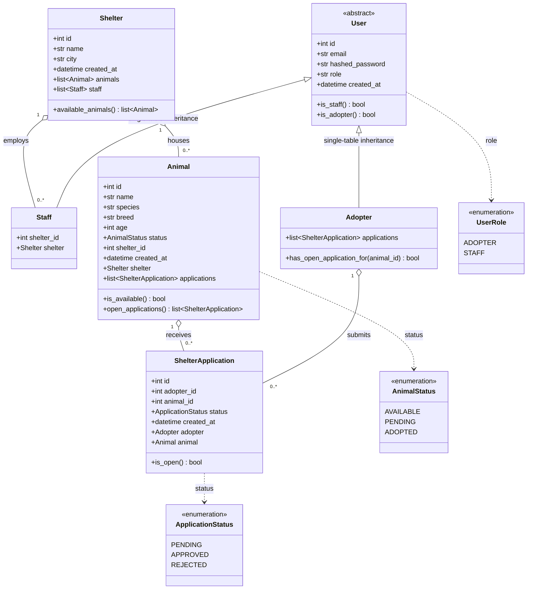
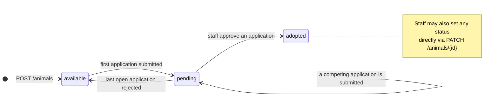
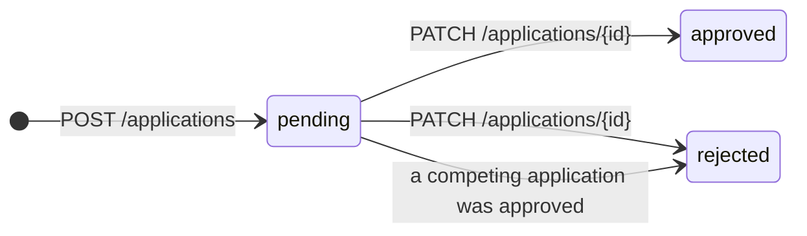

# UML — Model Layer

Class diagram of the ShelterHub domain model
([`backend/app/models.py`](../backend/app/models.py)). Rendered by GitHub
automatically; also viewable at [mermaid.live](https://mermaid.live).



## Inheritance mapping

`User`, `Staff` and `Adopter` share a **single `users` table**
(SQLAlchemy single-table inheritance). The discriminator is `users.role`, which
is the very same `role` field that `POST /auth/register` accepts and returns —
so the persistence layer and the public API cannot drift apart.

```
users
├── id, email, hashed_password, role, created_at   -- declared on User
└── shelter_id                                     -- declared on Staff, NULL for adopters
```

`User` declares no `polymorphic_identity`, so it is abstract in practice: every
row is a `Staff` or an `Adopter`. Querying `select(User)` returns both subtypes
as their concrete Python classes; `select(Adopter)` is automatically filtered to
`role = 'adopter'`.

`Staff.shelter_id` is nullable — the registration contract accepts no shelter,
and single-table inheritance requires subtype columns to be nullable since they
are shared with the other subtype.

## Status lifecycles





Transitions marked on the animal diagram that are **not** spelled out in
[API_CONTRACT.md](API_CONTRACT.md) are recorded in
[BACKEND_DECISIONS.md](BACKEND_DECISIONS.md).
